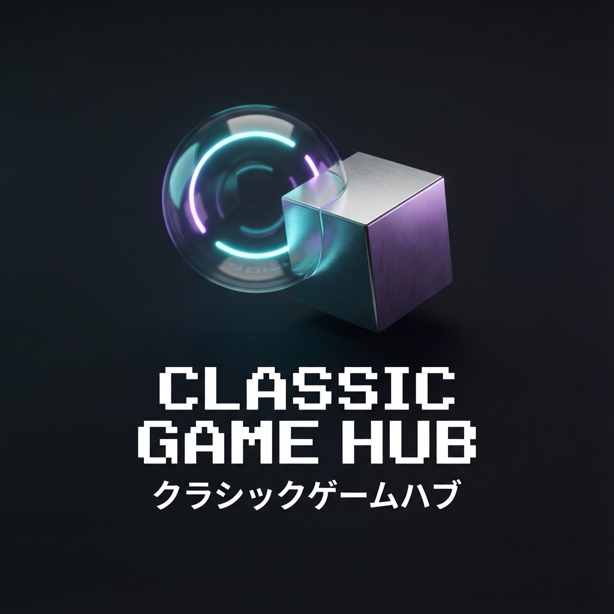

<div align="center">

  

  # 🎮 Classic Game Hub
  
  **A Modern, Real-time Multiplayer Arcade Experience**
  
  [](https://reactjs.org/)
  [](https://vitejs.dev/)
  [](https://tailwindcss.com/)
  [](https://socket.io/)
  [](https://nodejs.org/)

  <p align="center">
    <a href="https://classic-game-hub.onrender.com"><strong>🚀 Try Now</strong></a> •
    <a href="#-features">Features</a> •
    <a href="#-getting-started">Getting Started</a> •
    <a href="#-how-to-play">How to Play</a> •
    <a href="#-technologies">Technologies</a>
  </p>
</div>

---

## ✨ Overview

**Classic Game Hub** is a stunningly designed web application that brings your childhood favorite board games into the modern era. Featuring **Tic-Tac-Toe**, **Snake & Ladders**, and **Ludo**, this hub offers a seamless **Online Multiplayer** experience alongside local PvP and PvAI modes. 

Rebuilt for **v2.0** with a "Neon Retro" aesthetic, glassmorphism UI, client-side routing, and smooth Framer Motion animations, it's designed to look as good as it plays.

## 🚀 Features

- **🎲 Three Classic Games**:
  - **Tic-Tac-Toe**: The classic strategy game.
  - **Snake & Ladders**: Race to 100 with twists and turns.
  - **Ludo**: The ultimate 4-player strategy race.
- **🌐 Real-Time Multiplayer**: Hosted on a custom Node.js/Socket.io server for lag-free online play.
- **👤 Custom Name Profiles**: Set your unique identity that persists across local and online games.
- **😃 Live Reactions**: Express yourself in real-time with an interactive emoji reaction system.
- **🤖 Game Modes**:
  - **PvP (Local)**: Play on the same device.
  - **PvAI**: Challenge a smart AI bot (Tic-Tac-Toe & Snake & Ladders).
  - **Online**: Create or join rooms to play with friends anywhere. (*Note: This mode does not use optimistic updates; actions are confirmed by the server to ensure fairness. High ping may cause slight delays. The default server is located in Singapore; average ping tested in India is ~50ms on WiFi. If you face high latency, try hosting the server locally.*)
- **🎙️ Real-Time Voice Chat 2.0**:
  - **PeerJS Powered**: Completely overhauled voice stack using PeerJS for reliable, high-quality connections.
  - **Visualizer UI**: Beautiful, morphing audio visualizations and "talking" indicators.
  - **Full Control**: Mute, deafen, and collapsible floating UI.
- **🎨 Premium UI/UX**:
  - **Glassmorphism Design**: Sleek, modern, transparent aesthetics with 3D-rendered assets.
  - **Retro-Glitch Vibe**: Subtle digital glitch effects for a nostalgic arcade feel.
  - **Seamless Navigation**: Smooth transitions between games using React Router.
  - **Dark Mode**: Optimized for comfortable gaming.
  - **Responsive**: Fully playable on Desktop and Mobile.
  - **PWA Support**: Installable as a native app on your device.
- **⚙️ Customization**: Configure your own custom server URL directly from the settings.

## 🛠️ Technologies

### Client
- **React 19**: Latest React features for robust UI logic.
- **Vite**: Lightning-fast build tool and dev server.
- **Tailwind CSS 4**: Next-gen utility-first styling.
- **Framer Motion**: Complex, fluid layout animations.
- **Lucide React**: Beautiful, consistent iconography.
- **Simple Peer**: WebRTC wrapper for easy P2P voice connections.

### Server
- **Node.js**: Runtime environment.
- **Express**: Web server framework.
- **Socket.io**: Real-time, bidirectional event-based communication.

## 🏁 Getting Started

### Prerequisites
- Node.js (v18 or higher)
- pnpm (recommended) or npm

### Installation

1.  **Clone the repository**
    ```bash
    git clone https://github.com/KushalRoyChowdhury/classic-game-hub
    cd classic-game-hub
    ```

2.  **Install Dependencies**
    ```bash
    # Install client dependencies
    cd client
    pnpm install

    # Install server dependencies
    cd ../server
    pnpm install
    ```

### Running the Application

1.  **Start the Server** (Terminal 1)
    ```bash
    cd server
    pnpm run dev
    # Server runs on port 3001
    ```

2.  **Start the Client** (Terminal 2)
    ```bash
    cd client
    pnpm run dev
    # Client runs on http://localhost:5173 
    ```

3.  **Access the App**
    Open your browser and navigate to `http://localhost:5173`.

### 🔧 Configuration

**Environment Variables**:
Create a `.env` file in the `client` directory (optional):
```env
VITE_SERVER_URL=http://localhost:3001
```

**Custom Server**:
You can also set a custom server URL via the specialized **Settings Menu** (⋮) within the application interface.

## 📱 Progressive Web App (PWA)

This app is fully PWA compliant.
- **Install**: Click the "Install" button in your browser address bar.
- **Offline Capable**: Assets are cached for fast loading (game logic requires connection for online modes).

## 🤝 Contributing

Contributions are welcome!
1.  Fork the Project
2.  Create your Feature Branch (`git checkout -b feature/AmazingFeature`)
3.  Commit your Changes (`git commit -m 'Add some AmazingFeature'`)
4.  Push to the Branch (`git push origin feature/AmazingFeature`)
5.  Open a Pull Request

## 📄 License

Distributed under the MIT License. See `LICENSE` for more information.

---

<div align="center">
  Made with ❤️ by Kushal Roy Chowdhury
</div>
